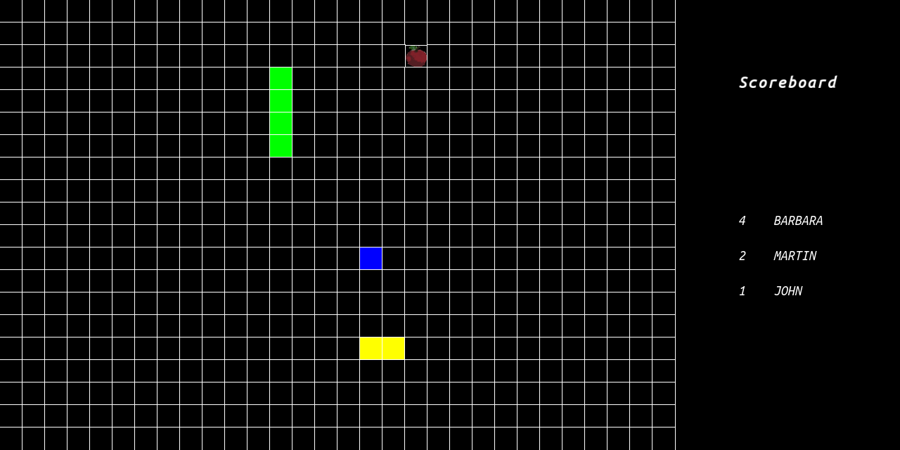

# MultiplayerSnake :snake:

#### What is it?
Classic snake game for up to 4 players using client-server communication.
Avoid other snakes, stay alive as long as possible and collect as many apples as you can!



Written in C++ using SFML library and low level socket programming on Linux platform.
SFML is included in project for convenient usage.

#### How to build and run?
Use CMake and Make. Start server with some port number, connect as client using
server's IP address and port, join game and wait for others!
```
cmake .
make
./ServerApp <port_num>
./ClientApp <ip_addr> <port_num>
```
It's important that you should run the executables from project root directory.
In other case there will be errors while loading assets from data folder.
Server handles up to 16 connected clients and only one game for up to 4 players.